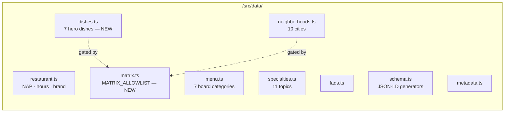
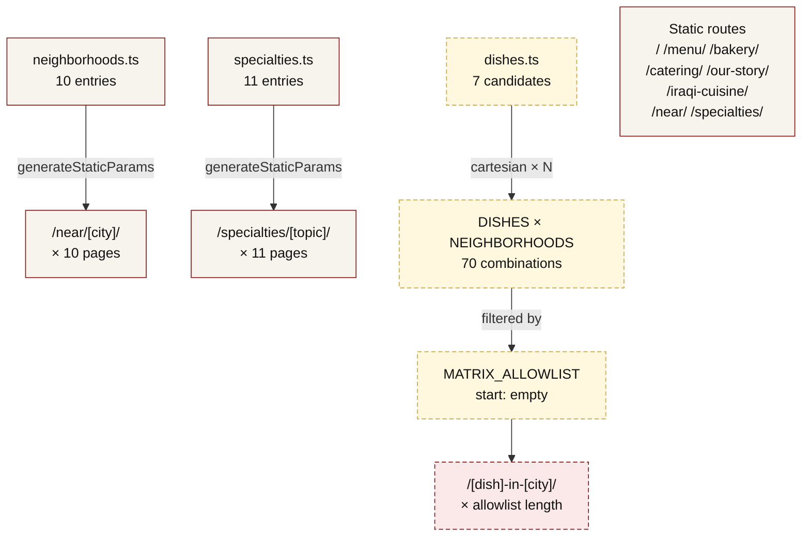
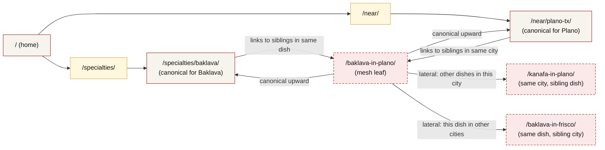
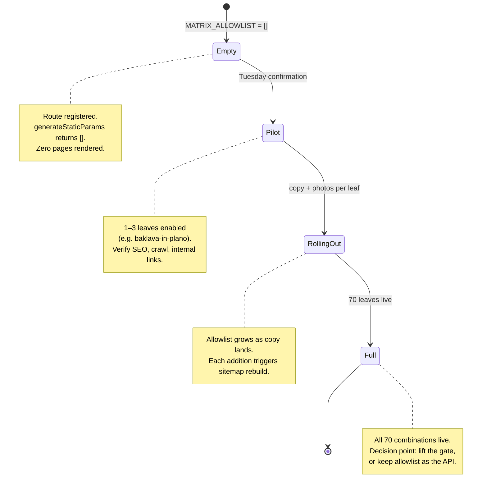

# City × dish mesh — structural diagram

**Status:** Pre-scaffold. Dish axis pending Tuesday 2026-05-19 confirmation.
Update this diagram whenever the structure changes (per brief: "Extend the diagram if structure shifts.")

## Data inputs

## Route generation

## Internal-link backbone

Each `/[dish]-in-[city]/` page is a leaf — it must crosslink upward (to canonical dish and canonical city) and laterally (to sibling combinations) to distribute authority and let crawlers traverse the mesh.

## Schema strategy per mesh leaf

Each `/[dish]-in-[city]/` page should inject:

| Schema | Source |
|---|---|
| `BreadcrumbList` | Home → Service Areas → [City] → [Dish], or Home → Specialties → [Dish] → [City] (pick one canonical; mirror `/specialties/[topic]/`'s pattern) |
| `WebPage` | `webPageSchema()` |
| `Article` | `articleSchema()` if body copy is long-form, like `/specialties/[topic]/` |
| `Restaurant` / `LocalBusiness` | inherited from global layout — no per-page injection needed |
| `FAQPage` | optional, if `DISHES[dish].faqs?.[city]` provides city-specific Q&A |
| `Menu` | optional, if dish maps to specific menu items — reuse `relatedItemsSchema` pattern from `/specialties/[topic]/` |

## Gating model

## Open questions surfaced by the diagram

1. **Canonical breadcrumb path** — is the mesh leaf a child of `/specialties/` (dish-first) or `/near/` (city-first)? Pick one and stick with it for `BreadcrumbList`. Recommendation: dish-first (`Specialties → Dish → in [City]`) because the dish is the searchable noun.
2. **Slug format** — `/baklava-in-plano/` is more SEO-natural than `/plano/baklava/` or `/baklava/plano/`. Confirm Tuesday.
3. **Lateral link budget** — linking to 9 sibling cities × 6 sibling dishes = 15 internal links per leaf, before any other content links. Keep it scannable.
4. **Allowlist shape** — `Array<[dishSlug, citySlug]>` or `Record<dishSlug, citySlug[]>`? Record form is easier to grep, array form is easier to extend by-row. Going with array of tuples for now.
